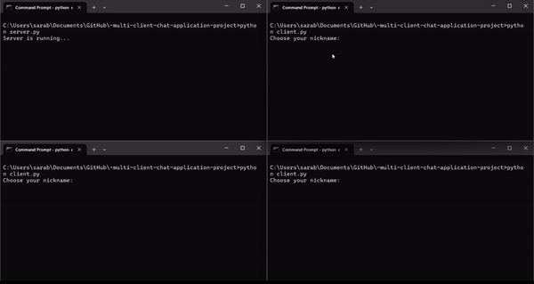

def generate_readme():
    readme_text = """
# Multi-Client Chat Application

This project is a multi-client chat application developed using socket programming and multithreading in Python. It demonstrates network programming, concurrent programming, and basic security concepts by enabling multiple clients to communicate with each other via a server. Clients can join private chat rooms (channels), send messages to all connected clients, and engage in private chats.

## Table of Contents

- [Features](#features)
- [Requirements](#requirements)
- [Installation](#installation)
- [Usage](#usage)
  - [Running the Server](#running-the-server)
  - [Running the Client](#running-the-client)
  - [Commands](#commands)
- [Project Structure](#project-structure)
- [How It Works](#how-it-works)
- [Security Features](#security-features)
- [Customization](#customization)
- [Contributing](#contributing)
- [License](#license)

## Features

- **Multiple Client Connections**: Handles multiple client connections simultaneously using threads.
- **Private Channels**: Allows clients to create, join, and leave private chat channels.
- **Broadcasting**: Sends messages to all clients or specific channels.
- **Private Messaging**: Enables clients to send private messages to each other.
- **Nickname Management**: Users can set and change their nicknames.
- **Help Commands**: Provides helpful commands like `/help`, `/listUsers`, and more.
- **User Status**: Shows whether a user is online or offline.
- **Password-Protected Channels**: Channels can require a password for joining.
- **Channel Management**: Users can create, join, and leave channels.
- **Real-Time Notifications**: Broadcasts notifications when users join/leave channels.
- **User Authentication**: Basic password-based authentication for accessing specific channels.

## Requirements

- Python 3.x
- No additional external libraries are required; the application uses standard Python libraries.

## Installation

1. Clone the repository:
    ```sh
    git clone https://github.com/yourusername/multi-client-chat-app.git
    cd multi-client-chat-app
    ```

2. Install the required packages (if any):
    ```sh
    pip install -r requirements.txt
    ```

## Usage

### Running the Server

1. Navigate to the project directory.
2. Run the server script:
    ```sh
    python server.py
    ```
3. The server will start and listen for client connections on `0.0.0.0:5555`. Clients can connect to this server using the IP address `127.0.0.1` (or the actual server IP if deployed remotely).

### Running the Client

1. Navigate to the project directory.
2. Run the client script:
    ```sh
    python client.py
    ```
3. The client will connect to the server at `127.0.0.1:5555`.

### Commands

- `/help`: Show a list of available commands and their descriptions.
- `/create [channel_name]`: Create a new private channel.
- `/join [channel_name]`: Join an existing private channel.
- `/leave`: Leave the current channel.
- `/listUsers`: List all connected users.
- `/listChannels`: List all available channels.
- `/nickname [new_nickname]`: Change your nickname.
- `/disconnect`: Disconnect from the server.
- `/prv [target_nickname] [message]`: Send a private message to a specific user.

### Additional Commands

- `/join [channel_name]`: Joins a specified channel, if available and not full.
- `/quit`: Leave the current channel.
- `/prv [target_nickname] [message]`: Send a private message to a specified user.
- `/create [channel_name]`: Creates a private channel and sets its parameters, such as the max number of users and password protection.

## Project Structure

The project contains the following main files:

- **server.py**: The main server file that handles client connections, communication, and management of channels.
- **client.py**: The client-side script that allows users to connect to the server and interact with the chat.
- **requirements.txt**: A text file listing any additional Python packages required for the project (if applicable).

### Directory Layout

multi-client-chat-app/ │ ├── server.py # Main server script ├── client.py # Main client script ├── requirements.txt # Python dependencies (if any) └── README.md # Project documentation


## How It Works

1. **Server-Side**: The server listens on a specific port for incoming client connections. It assigns each client a thread for handling communication and manages the creation of channels, broadcasting messages, and handling client commands.
  
2. **Client-Side**: Clients connect to the server, authenticate, and join channels. They can communicate with each other through public or private channels. The client interface is command-line based, allowing users to type messages and execute commands.

3. **Channels**: A channel can be either public or password-protected. When creating a new channel, the user is prompted to set the max number of users and a password (optional). Once a channel is created, users can join the channel and start chatting.

4. **Broadcasting**: Messages can be broadcast to all users or specific channels. If a user is in a channel, all members of that channel will receive the message.

5. **Private Messaging**: Users can send private messages to each other. The server ensures the message is delivered to the intended recipient.


## Security Features

- **Password Protection for Channels**: Channels can be password-protected, and users are prompted to enter a password to join.
- **Basic Authentication**: Some channels may require users to authenticate via a password before they can enter.
  
## Customization

- **Max Users Per Channel**: You can set a limit on the maximum number of users allowed in each channel.
- **Password Protection**: Optionally require a password to access specific channels.
- **Nicknames**: Clients can set their own nicknames, and these can be changed at any time.

### Customizable Parameters:

- **Maximum Users per Channel**: Modify the `max_users_dict` to set different limits for each channel.
- **Channel Passwords**: Define passwords for channels by adding entries in the `channel_passwords` dictionary.
  
## Contributing

Feel free to fork this repository, make changes, and create a pull request. If you find any bugs or want to suggest features, please create an issue.

## License

This project is licensed under the MIT License - see the [LICENSE](LICENSE) file for details.
"""

    with open("README.md", "w") as file:
        file.write(readme_text)
    print("README.md has been generated!")

# Call the function to generate the README file
generate_readme()
